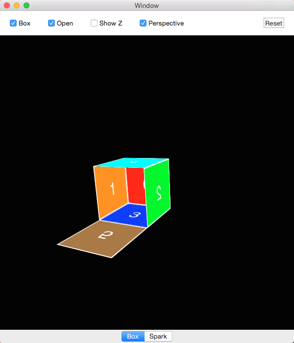

# Animation Showcase

An OS X app of Core Animation examples.

### Examples

* Box, showing layers folding into a box in 3D. (See WWDC 2011 Session 421, Core Animation Essentials.)
* Spark, showing a simple particle effect using CAEmitterLayer. (See Nick Lockwood's example.)

### Screenshot

### ToDo

* Add more examples!
